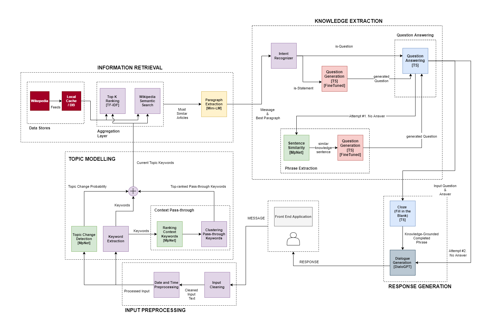

<h1 align="center">Hello, I am MUKALMA </h1>
<p align="center">
  <a href="https://github.com/DenverCoder1/readme-typing-svg"></a>

MUKALMA is a human-like chatbot which incorporates correct, relevant knowledge in its responses.

## How does it work?

- Takes key features from messages you send to it
- Uses those features to search Wikipedia for the most relevant articles
- Uses its Information Retrieval capabilities to identify sentence(s) that are most relevant to the conversation
- Incorporates knowledge from these sentences in human-like responses


## Installation

### Installing the required python packages
```sh
pip install virtualenv
cd src
virtualenv venv
source venv/bin/activate
pip install -r requirements.txt
```

### Downloading the submodels used by MUKALMA

MUKALMA has model size presets to achieve a tradeoff between model size and performance. It utilizes sub-models of different sizes to achieve this tradeoff. MUKALMA will automatically download any models that are missing from the ```models``` folder at the root of this repository.

The following table depicts the presets available for MUKALMA, and their accompanying model sizes. The presets can be customized in ```src/api/APIModel.py```.


| MUKALMA Preset | Model Size |
| ------ | ------ |
| small | 1.67 GB|
| medium | 3.40 GB |
| large | 5.47 GB |
| xlarge | 6.32 GB |

## Running MUKALMA

### Running the MUKALMA model

_Refer to the [MUKALMA API documentation](src/api/README.md) for more details_

#### Run MUKALMA locally
Note: Ensure you have selected your desired preset for MUKALMA's model size

```sh
cd src/api
set FLASK_APP=app.py
flask run
```

#### Run MUKALMA on Google Colaboratory
MUKALMA is present on a Google Drive account with the environment set up. Contact our team to request access to MUKALMA on Colab (See the Contact Us section at the bottom).  
If accepted, you will gain access to the MUKALMA_api notebook, which you can run to execute the MUKALMA model.  
The MUKALMA_api notebook runs a Flask API and exposes it via NGROK tunnelling. The final output of the notebook will be the ngrok link which is the URL at which MUKALMA's api is being hosted. This URL can be used by any client.  

### Running the sample frontend

```sh
cd src/front_end
npm install
npm start
```
On the top bar of the front-end, the link icon can be clicked to provide a link for the URL at which the API is being hosted.

_Refer to the [front-end documentation](src/front_end/README.md) for more details_

## Architecture


## Evaluations
For documentation and manuals regarding evaluations we conducted for MUKALMA, and steps on how to reproduce our results, view the [Evaluations Documentation](eval/README.md)

## Dataset used
The gold standard dataset used for evaluations is the Wizards of Wikipedia dataset. This [link](https://drive.google.com/drive/folders/1yYCOeMwm-8d9Q6KlM3vTx3vzjCNTeAF7?usp=sharing) contains the Wizards of Wikipedia dataset itself, along with a sample notebook used for extracting conversation turns from the dataset as in input for training/evaluating conversational models.  
As for training, we used a combination of pre-trained models within MUKALMA. The datasets used for training the pre-trained models will be updated here soon.

## Technologies
<div>
    
    
    &nbsp;
    &nbsp;
    &nbsp;
</div>

## License
GNU General Public License v3.0

## Contact us
- [Farjad Ilyas](mailto:ilyasfarjad@gmail.com?subject=[GitHub]%20Source%20Han%20Sans)
- [Nabeel Danish](mailto:nabeelben@gmail.com?subject=[GitHub]%20Source%20Han%20Sans)
- [Saad Saqlain](mailto:i180694@nu.edu.pk?subject=[GitHub]%20Source%20Han%20Sans)

