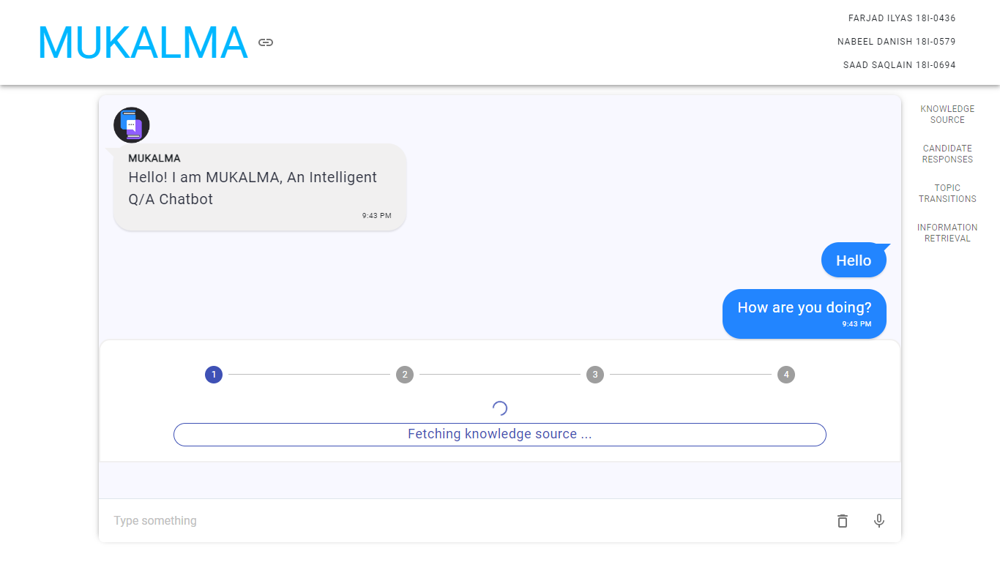

# MUKALMA Front End Application
A Front-End Application that can be used as a texting application similar to Facebook's Messenger Application. It connects to Mukalma's Flask API, running either on Google Colab, A personalized server or domain, or locally. 

*Front End Application Screen*

## Installation and Running
1. Make sure you are in the `front_end` directory before running the following commands.
2. Run the following command to install all node dependencies. 
> `npm install`
3. Run the following command to run the React application.
> `npm start`
4. The application will run on `localhost:3000` by default.
5. At this point, you will be able to see the React application on your browser. 
6. Click on the **Link Icon button** on the Application to open a text field.
7. Paste your `<MUKALMA API URL>` in the input field
8. The application will show the `CONNECTED` message to show that it has connected to the API. *(See below for a quick guide)*

## Technologies

    &nbsp;
    &nbsp;
    &nbsp;

## License
GNU General Public License v3.0

## Contact us
- [Farjad Ilyas](mailto:ilyasfarjad@gmail.com?subject=[GitHub]%20Source%20Han%20Sans)
- [Nabeel Danish](mailto:nabeelben@gmail.com?subject=[GitHub]%20Source%20Han%20Sans)
- [Saad Saqlain](mailto:i180694@nu.edu.pk?subject=[GitHub]%20Source%20Han%20Sans)